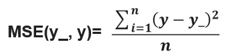

# TensorFlow

## 介绍

TensorFlow™ 是一个采用数据流图（data flow graphs），用于数值计算的开源软件库。节点（Nodes）在图中表示数学操作，图中的线（edges）则表示在节点间相互联系的多维数据数组，即张量（tensor）。它灵活的架构让你可以在多种平台上展开计算，例如台式计算机中的一个或多个CPU（或GPU），服务器，移动设备等等。

数据流图用“结点”（nodes）和“线”(edges)的有向图来描述数学计算。“节点” 一般用来表示施加的数学操作，但也可以表示数据输入（feed in）的起点/输出（push out）的终点，或者是读取/写入持久变量（persistent variable）的终点。“线”表示“节点”之间的输入/输出关系。这些数据“线”可以输运“size可动态调整”的多维数据数组，即“张量”（tensor）。张量从图中流过的直观图像是这个工具取名为“Tensorflow”的原因。一旦输入端的所有张量准备好，节点将被分配到各种计算设备完成异步并行地执行运算。

用张量表示数据，用计算图搭建神经网络，用会话执行计算图，优化线上的权重（参数），得到模型。

http://playground.tensorflow.org/

## TensorFlow 的计算模型、数据模型和运行模型

### TensorFlow计算模型——计算图

计算图——搭建神经网络的计算过程，只搭建，不运算。

TensorFlow 的名字中己经说明了它最重要的两个概念一一Tensor 和Flow 。Tensor 就是张量。张量这个概念在数学或者物理学中可以有不同的解释。在TensorFlow 中，张量可以被简单地理解为多维数组，如果说TensorFlow 的第一个词Tensor 表明了它的数据结构，那么Flow 则体现了它的计算模型。Flow 翻译成中文就是“流”，它直观地表达了张量之间通过计算相互转化的过程。

TensorFlow 是一个通过计算图的形式来表述计算的编程系统。TensorFlow中的每一个计算都是计算图上的一个节点，而节点之间的边描述了计算之间的依赖关系。


TensorFlow 程序一般可以分为两个阶段。

在第一个阶段需要定义计算图中所有的计算。
比如在上图向量加法样例程序中首先定义了两个输入，然后定义了一个计算来得到它们的和。

第二个阶段为执行计算。

```python
import tensorflow as tf
a= tf.constant([l.O, 2 .0], name =”a ”)
b = tf.constant([2.0, 3.0], name =”b ”)
result = a + b

```


### **TensorFlow数据模型——张量（tf.Tensor）**

https://tensorflow.google.cn/guide/tensors

张量——多维数组（列表），阶——张量的维数。

在TensorFlow程序中，所有的数据都通过张量的形式来表示。从功能的角度上看，张量可以被简单理解为**多维数组**。其中零阶张量表示标量（ scalar ） ，也就是一个数 ； 第一阶张量为向量（ vector),也就是一个一维数组；第n 阶张量可以理解为一个n 维数组。

| 阶   | 数学实例           |                             |
| ---- | ------------------ | --------------------------- |
| 0    | 标量（只有大小）   | s=123                       |
| 1    | 矢量（大小和方向） | v=[1,2,3]                   |
| 2    | 矩阵（数据表）     | m=[[1,2,3],[4,5,6],[7,8,9]] |
| n    | n 阶张量           | t=[[[[...]]]]      n个[]    |

但张量在Tensor Flow 中的实现并不是直接采用数组的形式，它只是对TensorFlow 中运算结果的引用。在张量中并没有真正保存数字，它保存的是如何得到这些数字的计算过程。还是以向量加法为例，当运行如下代码时，并不会得到加法的结果，而会得到对结果的一个引用。

```python
import tensorflow as tf
# tf.constant 是一个计算，这个计算的结果为一个张量， 保存在变量a 中。
a = tf.constant([1.0,2.0],name ='a')
b = tf.constant([2.0,3.0], name ='b')
result = tf.add(a,b, name='add')
print(result)
'''
输出：
Tensor("add:0", shape=(2,), dtype=float32)
'''
```

从上面代码的运行结果可以看出， 一个张量中主要保存了三个属性： 

**名字（ name ）、维度（ shape ）和类型（ type ）**。

我们从上图了解了Tensor Flow 的计算都可以通过计算图的模型来建立，而计算图上的每一个节点代表了一个计算，计算的结果就保存在张量之中。所以张量和计算图上节点所代表的计算结果是对应的。

结果：Tensor(“add:0”, shape=(2,), dtype=float32) 
张量表示的意思：Tensor(name名字，shape维度，type类型) 
其中，名字的表示形式为：node:src_output。node为节点的名称，src_output表示当前张量来自节点的第几个输出。add:0就表示，result这个张量是计算节点“add”输出的第一个结果（编号从0开始）。 

张量的第二个属性是张量的维度（ shape ）。这个属性描述了一个张量的维度信息。比如上面样例中 shape = ( 2,  ) 说明了张量result 是一个一维数组， 这个数组的长度为2 。

张量的第三个属性是类型（ type ），每一个张量会有一个唯一的类型。TensorFlow 会对参与运算的所有张量进行类型的检查， 当发现类型不匹配时会报错。

TensorFlow 支持14 种不同的类型， 主要包括了实数（ tf.float32 、tf.float64 ）、整数（ tf.int8 、tf.intl6 、tf.int32 、tf.int64 、tf.uint8 ）、布尔型（ tf.bool) 和复数（ tf.complex64 、tf.complex128 ） 。


### TensorFlow运行模型——会话（session）

执行计算图中的节点运算。

前面的两节介绍了TensorFlow 是如何组织数据和运算的。本节将介绍如何使用
TensorFlow 中的会话（ session ）来执行定义好的运算。会话拥有并管理TensorFlow 程序运行时的所有资源。所有计算完成之后需要关闭会话来帮助系统回收资源，否则就可能出现资源泄漏的问题。TensorFlow 中使用会话的模式一般有两种，第一种模式需要明确调用会话生成函数和关闭会话函数，这种模式的代码流程如下。

```python
# 创建一个会话。
sess = tf.Session()

#使用这个创建好的会话来得到关心的运算的结果。比如可以调用sess.run(result),
# 来得到上述例中张量result 的取值。
print(sess.run(result))

# 关闭会话使得本次运行中使用到的资源可以被释放。
sess.close()
```

使用这种模式时，在所有计算完成之后，需要明确调用Session.close 函数来关闭会话并释放资源。

为了解决异常退出时资源释放的问题， TensorFlow 可以通过Python 的上下文管理器来使用会话。以下代码展示了如何使用这种模式。

```python
#创建一个会话，并通过Python 中的上下文管理器来管理这个会话。
with tf.Session() as sess:
#使用创建好的会话来计算关心的结果。
  print(sess.run(result))
#不需要再调用" Session.close()"函数来关闭会话，
#当上下文退出时会话关闭和资源释放也自动完成了。
```

通过Python 上下文管理器的机制，只要将所有的计算放在“ with ”的内部就可以。当上下文管理器退出时候会自动释放所有资源。这样既解决了因为异常退出时资源释放的问题，同时也解决了忘记调用Session.close 函数而产生的资源泄漏。

tf.lnteractiveSession()函数会自动将生成的会话注册为默认会话

```python
sess = tf.InteractiveSession ()
print(result.eval())
sess.close()
```

## 变量（ tf. Variable ）

变量（ tf. Variable ）的作用就是保存和更新神经网络中的参数。

参数：即线上的权重W，用变量表示，随机给初值。

当创建一个变量时，你将一个张量作为初始值传入构造函数Variable()。TensorFlow提供了一系列操作符来初始化张量，初始值是常量或是随机值。

注意，所有这些操作符都需要你指定张量的shape。那个形状自动成为变量的shape。变量的shape通常是固定的，但TensorFlow提供了高级的机制来重新调整其行列数。

`

```python
# Create two variables.
weights = tf.Variable(tf.random_normal([100, 200], stddev=0.35,mean = 0, seed=1),name="weights")
#正态分布，产生100*200的矩阵，标准差为0.35，均值为0.随机种子
biases = tf.Variable(tf.zeros([200]), name="biases")
```

`

| 神经网络中常用的生成随机数数组的函数有： |                                    |
| ---------------------------------------- | ---------------------------------- |
| tf.random_normal()                       | 生成正态分布随机数                 |
| tf.truncated_normal()                    | 生成去掉过大偏离点的正态分布随机数 |
| tf.random_uniform()                      | 生成均匀分布随机数                 |
| tf.zeros                                 | 表示生成全 0 数组                  |
| tf.ones                                  | 表示生成全 1 数组                  |
| tf.fill                                  | 表示生成全定值数组                 |
| tf.constant                              |                                    |

常量和变量的区别

变量的初始化必须在模型的其它操作运行之前先明确地完成。最简单的方法就是添加一个给所有变量初始化的操作，并在使用模型之前首先运行那个操作。

<u></u>

```python
# Create two variables.
weights = tf.Variable(tf.random_normal([784, 200], stddev=0.35),name="weights")
biases = tf.Variable(tf.zeros([200]), name="biases")
...
# Add an op to initialize the variables.
init_op = tf.initialize_all_variables()

# Later, when launching the model
with tf.Session() as sess:
  # Run the init operation.
  sess.run(init_op)
  ...
  # Use the model
  ...
```

## 

## TensorFlow 游乐场

通过TensorFlow 游乐场来快速介绍神经网络的主要功能。TensorFlow 游乐场

( http://playground.tensorflow.org/） 是一个通过网页浏览器就可以训练的简单神经网络并实现
了可视化训练过程的工具。


TensorFlow 游乐场的左侧提供了4 个不同的数据集来测试神经网络。默认的数据为左上角的DATA。输出结果为右侧的OUTPUT。在这个数据中，可以看到一个二维平面上有黑色或者灰色的点，每一个小点代表了一个样例，而点的颜色代表了样例的标签。因为点的颜色只有两种，所以这是一个二分类的问题。在这里举一个例子来说明这个数据可以代表的实际问题。


假设需要判断某工厂生产的零件是否合格，那么灰色的点可以表示所有合格的零件而黑色的表示不合格的零件。这样判断一个零件是否合格就变成了区分点的颜色。

为了将一个实际问题对应到平面上不同颜色点的划分，还需要将实际问题中的实体，比如上述例子中的零件，变成平面上的一个点。这就是特征提取解决的问题。还是以零件为例，可以用零件的长度和质量来大致描述一个零件。这样一个物理意义上的零件就可以被转化成长度和质量这两个数字。在机器学习中，所有用于描述实体的数字的组合就是一个实体的特征向量（ feature vector ）。通过特征提取，就可以将实际问题中的实体转化为空间中的点。假设使用长度和质量作为一个零件的特征向量，那么每个零件就是二维平面上的一个点。TensorFlow 游乐场中FEATURES 一栏对应了特征向量。在样例中，可以认为X1代表一个零件的长度，而X2 代表零件的质量。特征向量是神经网络的输入，神经网络的主体结构显示在图的中间位置。目前主流的神经网络都是分层的结构，第一层是输入层，代表特征向量中每一个特征的取值。比如如果一个零件的长度是0.5 ，那么x1的值就是0.5 。同一层的节点不会相互连接，而且每一层只和下一层连接，直到最后一层作为输出层得到计算的结果。在二分类问题中，比如判断零件是否合格，神经网络的输出层往往只包含一个节点，而这个节点会输出一个实数值。通过这个输出值和一个事先设定的阀值，就可以得到最后的分类结果。以判断零件合格为例，可以认为当输出的数值大于0 时，给出的判断结果是零件合格，反之则零件不合格。一般可以认为当输出值离阔值越远时得到的答案越可靠。在输入和输出层之间的神经网络叫做隐藏层， 一般一个神经网络的隐藏层越多，这个神经网络越“深”。而所谓深度学习中的这个“深度”和神经网络的层数也是密切相关的。

在TensorFlow 游乐场中可以通过点击“＋”或者“－”来增加或减少神经网络隐藏层的数量。除了可以选择神经网络的深度， TensorFlow 游乐场也支持选择神经网络每一层的节点数以及学习率（ learning rate ）、激活函数（ activation ）、正则化（ regularization ） 。当所有配置都选好之后，可以通过左上角的开始标志来训练这个神经网络。

一个小格子代表神经网络中的一个节点，而边代表节点之间的连接。每一个节点和边都被涂上了或深或浅的颜色，但边上的颜色和格子中的颜色含义有略微的区别。每一条边代表了神经网络中的一个参数，它可以是任意实数。神经网络就是通过对参数的合理设置来解决分类或者回归问题的。边上的颜色体现了这个参数的取值， 当边的颜色越深时，这个参数取值的绝对值越大； 当边的颜色接近白色时，这个参数的取值接近于0 。

每一个节点上的颜色代表了这个节点的区分平面。具体来说，如果把这个平面当成一个笛卡儿坐标系，这个平面上的每一个点就代表了（x1, x2 ） 的一种取值。而这个点的颜色就体现了x1, x2在这种取值下这个节点的输出值。和边类似，当节点的输出值的绝对值越大时，颜色越深。下面将具体解读输入层x1所代表的节点。从图中可以看到X1 这个节点的区分平面就是y 轴。因为这个节点的输出就是X1 本身的值，所以当X1 小于0 时，这个节点的输出就是负数，而x1大于0 时输出的就是正数。于是y 轴的左侧都为灰色，而右侧都为黑色。 图 中其他节点可以进行类似的解读。唯一特殊的是最右边OUTPUT 栏下的输出节点。这个节点中除了显示了区分平面，还显示了训练数据，也就是希望通过神经网络区分的数据点。从图中可以看到，经过两层的隐藏层，输出节点的区分平面已经可以完全区分不同颜色的数据点。(在TensorFlow 游乐场中， y 轴左侧为黄色（文中浅色部分），右侧为蓝色)

综上所述，使用神经网络解决分类问题主要可以分为以下4 个步骤。

1. 提取问题中实体的特征向量作为神经网络的输入。不同的实体可以提取不同的特征向量。
2. 定义神经网络的结构，并定义如何从神经网络的输入得到输出。这个过程就是神经网络的前向传播算法。
3. 通过训练数据来调整神经网络中参数的取值，这就是训练神经网络的过程。
4. 使用训练好的神经网络来预测未知的数据。这个过程和步骤2 中的前向传播算法一致。

## 神经网络的实现过程

1、准备数据集，提取特征，作为输入喂给神经网络（ Neural Network NN)
2、搭建 NN 结构，从输入到输出（先搭建计算图，再用会话执行）
​				 （NN 前向传播算法 ---->计算输出）
3、大量特征数据喂给 NN ，迭代优化 NN 参数
​					(NN 反向传播算法 ---->优化参数训练模型)
4、使用训练好的模型预测和分类

## 神经元结构

神经元是构成一个神经网络的最小单元，图3-4 显示了一个最简单的神经元结构。


从图中可以看出， 一个神经元有多个输入和一个输出。每个神经元的输入既可以是其他神经元的输出，也可以是整个神经网络的输入。所谓神经网络的结构指的就是不同神经元之间的连接结构。如图中所示， 一个最简单的神经元结构的输出就是所有输入的加权和 ，而不同输入的权重就是神经元的参数。神经网络的优化过程就是优化神经元中参数取值的过程，我们将重点介绍神经网络的前向传播过程。


上图给出了一个简单的判断零件是否合格的三层全连接神经网络。之所以称之为全连接神经网络是因为相邻两层之间任意两个节点之间都有连接。

图中除输入层之外的所有节点都代表了一个神经元的结构。接下来将通过这个样例来解释前向传播的整个过程。


## 前向传播算法

前向传播就是搭建模型的计算过程 让模型具有推理能力 可以针对一组输入给出相应的输出 。

计算神经网络的前向传播结果需要三部分信息。第一个部分是神经网络的输入，这个输入就是从实体中提取的特征向量。


比如在图中有两个输入， 一个是零件的长度x1，一个是零件的质量x2 。第二个部分为神经网络的连接结构。神经网络是由神经元构成的，神经网络的结构给出不同神经元之间输入输出的连接关系。神经网络中的神经元也可以称之为节点。在图中，a11  节点有两个输入，他们分别是X1 和X2 的输出。而a11 的输出则是节点y 的输入。最后一个部分是每个神经元中的参数。在图中用W 来表示神经元中的参数。W 的上标表明了神经网络的层数，比如以w1表示第一层节点的参数，而以w2 表示第二层节点的参数。W 的下标表明了连接节点编号，比如W1/1,2表示连接X 1 和a12 节点的边上的权重。如给定神经网络的输入、神经网络的结构以及边上权重，就可以通过前向传播算法来计算出神经网络的输出。


下图展示了这个神经网络前向传播的过程。


上图给出了输入层的取值x1 =0 .7 和X2=0.9 。从输入层开始一层一层地使用向前传播算法。首先隐藏层中有三个节点， 每一个节点的取值都是输入层取值的加权和。下面给出了a 11 取值的详细计算过程：


a12 和a13 也可以通过类似的方法计算得到，图中也给出了具体的计算公式。在得到第一层节点的取值之后，可以进一步推导得到输出层的取值。类似地，输出层中节点的取值就是第一层的加权和：


因为这个输出值大于阈值0，所以在这个样例中最后给出的答案是：这个产品是合格的。这就是整个前向传播的算法。前向传播算法可以表示为矩阵乘法。将输入X1,X2 组织成一个 1× 2 的矩阵x=[x1,x2 ］ ，而w1组织成一个2 × 3 的矩阵：


这样通过矩阵乘法可以得到隐藏层三个节点所组成的向量取值：


类似的输出层可以表示为：


```python
x =tf.placeholder(tf.float32, shape=(None,2))
y_ =tf.placeholder(tf.float32, shape=(None,1))

w1=tf.Variable(tf.random_normal([2,3],stddev=1,seed=1))
w2=tf.Variable(tf.random_normal([3,1],stddev=1,seed=1))

a= tf.matmul(x,w1)
y= tf.matmul(a,w2)
```

### 前向传播过程 的 tensorflow 描述

变量初始化、计算图节点运算都要用会话（ with 结构）实现

```python 
with tf.Session() as sess:
	sess.run()
```

变量初始化：在 sess.run 函数中用 tf.global_variables_initializer() 汇总所有待优化变量。

```python
init_op = tf.global_variables_initializer()
sess.run(init_op)
```

计算图节点运算：在sess.run函数中写入待运算的节点

```python
sess.run(y)
```

用 tf.placeholder占位，在 sess.run 函数中用函数中用 feed_dict喂数据

```python
#喂一组数据：
x = tf.placeholder(tf.float32, shape=(1, 2))
sess.run(y, feed_dict={x: [[0.5,0.6]]})
#喂多组数据：
x = tf.placeholder(tf.float32, shape=(None, 2))
sess.run(y, feed_dict={x: [[0.1,0.2],[0.2,0.3],[0.3,0.4],[0.4,0.5]]})
```


## 反向传播

反向传播 ：训练模型参数 ，在所有参数上用梯度下降，使神经网络模型在训练数据上的损失函数最小。

### 损失函数

损失函数的计算有很多方法。

#### 解决回归问题的损失函数：均方误差MSE




用tensorflow 函数表示为loss_mse = tf.reduce_mean(tf.square(y_ - y))

反向传播训练方法： 以减小 loss 值为优化目标 ，有梯度下降 、 momentum优化器 、 adam优化器等优化方法。

这三种优化方法用tensorflow 的函数可以表示为：

```python
train_step=tf.train.GradientDescentOptimizer(learning_rate).minimize(loss)

train_step=tf.train.MomentumOptimizer(learning_rate,momentum).minimize(loss)

train_step=tf.train.AdamOptimizer(learning_rate).minimize(loss)
```


1. tf.train.GradientDescentOptimizer 使用随机梯度下降算法，使参数沿着
   梯度的反方向，即总损失减小的方向移动，实现更新参数。

   其中，𝐽(𝜃)为损失函数， 𝜃为参数， 𝛼为学习率。

   

2. tf.train.MomentumOptimizer() 在更新参数时，利用了超参数，参数更新公式是

   其中，𝛼为学习率，超参数 为 𝛽 𝜃为参数， 𝑔(𝜃𝑖−1)为损失函数 的梯度 。

   

3. tf.train.AdamOptimizer() 是利用自适应学习率的优化算法， Adam 算法和随机梯度下降算法不同。随机梯度下降算法保持单一的学习率更新所有的参数，学习率在训练过程中并不会改变。而 Adam 算法通过计算梯度的一阶矩估计和二阶矩估计而为不同的参数设计独立的自适应性学习率。

学习率 learning_rate： 决定每次参数更新的幅度。
优化器中都需要一个叫做学习率的参数，使用时如果学习率选择过大会导致待优化的参数在最小值附近波动不收敛的情况，如果学习率选择过小，会出现收敛速度慢的情况。 我们可以选个比较小的值填入， 比如 0.01 、 0.001。

#### 解决分类问题的损失函数：交叉熵（ cross entropy ）

交叉熵刻画了两个概率分布之间的距离， 它是分类问题中使用比较广的一种损失函数。

交叉熵越大，两个概率分布距离越远， 两个概率分布越相异 ;

交叉熵越小，两个概率分布距离越近 ，两个概率分布越相似 。

假设有两个分布p，q，则它们在给定样本集上的交叉熵定义如下： 
$$
CE(p,q)=−\sum_{}p(x)logq(x)
$$

------

用Tensorflow 函数表示 为
ce=tf.reduce_mean(p\* tf.log(tf.clip_by_value(q, 1e-12, 1.0))) 

（1e-12 是为了防止log0出现）

两个神经网络模型解决二分类问题中，已知标准答案为p = (1, 0)，第一个神经网络模型预测结果为q1=(0.6, 0.4)，第二个神经网络模型预测结果为q2=(0.8, 0.2)，判断哪个神经网络模型预测的结果更接近标准答案。
根据交叉熵的计算公式得：
H1((1,0),(0.6,0.4)) = -(1\*log0.6 + 0\*log0.4) ≈≈ -(-0.222 + 0) = 0.222
H2((1,0),(0.8,0.2)) = -(1\*log0.8 + 0\*log0.2) ≈≈ -(-0.097 + 0) = 0.097
由于0.222>0.097，所以预测结果y2与标准答案与标准答案y_更接近，y2预测更准确。


## 神经网络计算过程：

1. 导入模块，生成模拟数据集；
   import
   常量定义
   生成数据集

2. 前向传播：定义输入、参数和输出
   x=              y_ =
   w1=           w2=
   a=              y=

3. 反向传播：定义损失函数、反向传播方法
   loss=
   train_step=

4. 生成会话，训练 STEPS 轮

   ```python
   with tf.session() as sess
       Init_op=tf. global_variables_init ializer()
       sess_run(init_op)
       STEPS=3000
       for i in range(STEPS):
           start=
           end=
           sess.run(train_step, feed_dict:)
   ```

### 代码1


```python
#coding utf-8
#导入模块，生成模拟数据集
import tensorflow as tf
import numpy as np
BATCH_SIZE =8
seed =23455

#基于seed产生随机数
rng = np.random.RandomState(seed)
#随机数返回32行2列的矩阵，表示32组宽度和长度作为输入数据集
X= rng.rand(32,2)
#从这个32行2列的矩阵中，取出一行，判断如果和小于1，给Y赋值1；
# 如果和不小于1，给Y赋值0，作为输入数据集的标签
Y = [[int(x0 +x1 < 1)] for (x0,x1) in X]
print("X:",X)
print("Y:",Y)

#定义神经网络的输入、参数和输出，定义向前传播过程
x =tf.placeholder(tf.float32, shape=(None,2))
y_ =tf.placeholder(tf.float32, shape=(None,1))

w1=tf.Variable(tf.random_normal([2,3],stddev=1,seed=1))
w2=tf.Variable(tf.random_normal([3,1],stddev=1,seed=1))

a= tf.matmul(x,w1)
y= tf.matmul(a,w2)

#定义损失函数及反向传播方法
loss=tf.reduce_mean(tf.square(y-y_))
train_step = tf.train.GradientDescentOptimizer(0.001).minimize(loss)
#train_step=tf.train.MomentumOptimizer(0.001,0.9).minimize(loss)
#train_step=tf.train.AdamOptimizer(0.001).minimize(loss)

#生成会话，训练STEPS轮
with tf.Session() as sess:
    init_op=tf.global_variables_initializer()
    sess.run(init_op)
    #输出目前（未经训练）的参数取值
    print("w1:", sess.run(w1))
    print("w2:", sess.run(w2))

    #训练模型
    STEPS= 3000
    for i in range(STEPS):
        start = (i*BATCH_SIZE) % 32
        end = start + BATCH_SIZE
        sess.run(train_step,feed_dict={x:X[start:end], y_ :Y[start:end]})
        if i % 500 ==0:
            total_loss =sess.run(loss,feed_dict={x:X,y_:Y})
            print("After %d training steps, loss on all data is %g"%(i,total_loss))
    #输出训练后的参数数值
    print("w1:",sess.run(w1))
    print("w2:",sess.run(w2))

```

由神经网络的实现 结果，我们可以看出，总共 训练 3000 轮。 每轮从 X 的数据集和 Y 的标签中抽取相对应的从 start 开始到 end 结束个特征值 和 标签 喂入神经网络。 用 sess.run 求出 loss， 每 500 轮打印一次 loss 值 。经过 3000 轮后 我们打印出 最终训练好的 参数 w1 、 w2 。

### 代码2

https://blog.csdn.net/wyx100/article/details/80467130

```python
import tensorflow as tf
import numpy as np

# 使用 NumPy 生成假数据(phony data), 总共 100 个点.
x_data = np.float32(np.random.rand(2, 100)) # 随机输入 生成一个矩阵 2（行）x 100 （列），矩阵每个值是随机生成
y_data = np.dot([0.100, 0.200], x_data) + 0.30  # 矩阵乘法，本例中 1x2矩阵和2x100矩阵相乘，生成 1x100 矩阵，y_data 是label
# y_data[0] = 0.1 x x_data{0][0] + 0.2 x x_data{1][0] +0.3
#             0.1 x 0.12674105  + 0.2 x 0.41159454
sum = 0.1 * x_data[0][0] + 0.2 * x_data[1][0] + 0.3
print(sum)  # 0.3949930131435394
print(0.1 * x_data[0][0] + 0.2 * x_data[1][0] + 0.3)  # 0.3949930131435394

print(type(y_data))  # <class 'numpy.ndarray'>
print(y_data, 'y_data')
print(type(x_data)) # <class 'numpy.ndarray'>
print(x_data,'x_data')
# 构造一个线性模型
#
b = tf.Variable(tf.zeros([1]))
W = tf.Variable(tf.random_uniform([1, 2], -1.0, 1.0))
y = tf.matmul(W, x_data) + b

# 最小化方差
loss = tf.reduce_mean(tf.square(y - y_data))
optimizer = tf.train.GradientDescentOptimizer(0.5)
train = optimizer.minimize(loss)

# 初始化变量
init = tf.initialize_all_variables()

# 启动图 (graph)
sess = tf.Session()
sess.run(init)

# 拟合平面
for step in range(0, 201):
    sess.run(train)
    if step % 20 == 0:
        print(step, sess.run(W), sess.run(b))

# 得到最佳拟合结果 W: [[0.100  0.200]], b: [0.300]
```

### 代码3

```python
#coding:utf-8
#预测多或预测少的影响一样
#导入模块，生成数据集
import tensorflow as tf
import numpy as np
BATCH_SIZE =8
seed =23455

rdm = np.random.RandomState(seed)
X = rdm.rand(32,2)
Y_ = [[x1+x2+(rdm.rand()/10.0-0.05)] for (x1,x2) in X]

#定义神经网络的输入、参数和输出，定义向前传播过程。
x = tf.placeholder(tf.float32,shape=(None,2))
y_ = tf.placeholder(tf.float32,shape=(None,1))
w1 = tf.Variable(tf.random_normal([2,1], stddev=1,seed=1))
y = tf.matmul(x,w1)

#定义损失函数及反向传播方法
#定义损失函数为MSE,反向传播方法为梯度下降。
loss_mse = tf.reduce_mean(tf.square(y_ - y))
train_step = tf.train.GradientDescentOptimizer(0.001).minimize(loss_mse)

#生成会话，训练STEPS轮
with tf.Session() as sess:
    init_op = tf.global_variables_initializer()
    sess.run(init_op)
    STEPS=20000
    for i in range(STEPS):
        start =(i*BATCH_SIZE) %32
        end =(i*BATCH_SIZE) %32 + BATCH_SIZE
        sess.run(train_step,feed_dict={x: X[start:end], y_:Y_[start:end]})
        if i % 500 ==0:
            print(u"第 %d 次训练后, w1的值是: " % (i))
            print(sess.run(w1), "\n")
    print(u"最终w1的值是: \n", sess.run(w1))
```

## 神经网络优化

神经元模型： 用数学公式表示为： 
$$
𝐟(\sum_{i}𝒙_i𝒘_i+𝐛)
$$
f 为激活函数，b为偏置项， 神经网络是以神经元为基本单元构成的。

### 激活函数

线性模型能够解决的问题是有限的，这是线性模型的最大局限，所以深度学习强调非线性。

激活函数： 引入非线性激活因素， 提高模型的表达力 。


神经网络结构加上激活函数和偏置项后的前向传播算法的数学定义：


常用的激活函数有 relu 、 sigmoid 、 tanh 等。其中sigmoid/tanh比较常见于全连接层，ReLU常见于卷积层。

1. 激活函数ReLU(The Rectified Linear Unit，修正线性单元)在 Tensorflow 中， 用 tf.nn.relu() 表示。

   它的特点是收敛快，求梯度简单。计算公式也很简单，max(0,T)，即对于输入的负值，输出全为0，对于正值，则原样输出。


加入偏置项和ReLU 激活函数之后，隐藏层推导公式：


输出层推导公式：


偏置项可以被表达为一个输出永远为1 的节点：


```python
a= tf.nn.relu(tf.matmul(x, wl) + biasesl)
y = tf.nn.relu(tf.matmul(a, w2) + biases2)
```

2. 逻辑函数（logistic function）sigmoid ：在 Tensorflow 中， 用 tf.nn.sigmoid() 表示


3. 双曲正切函数（hyperbolic tangent function）激活函数 tanh ：在 Tensorflow 中， 用 tf.nn.tanh() 表示


总结：

神经网络的复杂度：可用神经网络的层数和神经网络中待优化参数个数表示
神经网路的层数：一般不计入输入层，层数 = n 个隐藏层 + 1 个输出层
神经网路待优化的参数：神经网络中所有参数：神经网络中所有参数w的个数 +  所有参数b的个数


在该神经网络中，包含1 个输入层、 1 个隐藏层和 1 个输出层，该神经网络的层数为 2 层。

在该神经网络中，参数的个数是所有参数 w 的个数加上所有参数 b 的总数。

第一层参数用三行四列的二阶张量表示（ 即 12 个 线上的权重 w） 再加上4 个偏置 b。

第二层参数是四行两列的二阶张量（即8 个 线上的权重 w） 再加上2 个偏置 b 。

总参数 3\*4+4 + 4*2+2 = 26 


## mnist 数据集

mnist 数据集 ：包含 7 万张 黑底白字手写数字 图片， 其中 55000 张为训练集，5000 张为验证集， 1 0000 张 为测试集 。每张图片大小为 28*28 像素，图片中 纯 黑色像素 值为 0， 纯 白色像素值为 1 。数据集的标签是长度为 10 的一维数组，数组中每个元素索引号表示对应数字出现的概率 。

tf.cast(x,dtype) 函数表示将参数 x 转换为指定 数据 类型 。

tf.reduce_mean( x,axis 函数表示求取矩阵或张量指定维度的平均值。 

tf argmax(x,axis) 函数表示 返回 指定维度 a xis 下，参数 x 中 最大值索引号 。

os.path.join 函数表示 把 参数 字符串按照路径命名规则拼接。

字符串 split( 函数表示 按照指定 拆分符 对字符串拆分 返回拆分列表 。


## 神经网络模型的保存(tf.train.Saver)

https://tensorflow.google.cn/guide/saved_model

在反向传播过程中，一般会间隔一定轮数保存一次神经网络模型，并产生三个文件（保存当前图结构的.meta文件、保存当前参数名的.index文件、保存当前参数的.data文件）

```python
saver = tf.train.Saver()
with tf.Session() as sess:
    init_op = tf.global_variables_initializer()
    sess.run(init_op)
    for i in range(STEPS):
        xs, ys = sess.run([train_op, loss, global_step], feed_dict={x: xs, y_: ys})
        if i % 1000 == 0:
            print("After %d training step(s), loss on training batch is %g." % (step, loss_value))
            saver.save(sess, os.path.join(MODEL_SAVE_PATH, MODEL_NAME), global_step=global_step)        
```

## 神经网络模型的加载(tf.train.Saver.restore )

在测试网络效果时，需要将训练好的神经网络模型加载

```python

with tf.Session() as sess:
    ckpt = tf.train.get_checkpoint_state(mnist_backward.MODEL_SAVE_PATH)
    #加载ckpt模型
    if ckpt and ckpt.model_checkpoint_path:
        saver.restore(sess, ckpt.model_checkpoint_path)

```

## AutoGraph：图的简易控制流程

tf.Graph().as_default() 函数表示将当前图设置成为默认图，并返回一个上下文管理器。 该函数 一般与 with 关键字 搭配使用 ，应用于将 已经定义好的 神经网络在计算图中复现。

https://tensorflow.google.cn/guide/autograph

```python
with tf.Graph().as_default() as g:
    x = tf.placeholder(tf.float32, [None, mnist_forward.INPUT_NODE])
    y_ = tf.placeholder(tf.float32, [None, 	mnist_forward.OUTPUT_NODE])
    y = mnist_forward.forward(x, None)
```


## 神经网络模型准确率评估方法

在网络评估时，一般通过计算在一组数据上的识别准确率评估神经网络的效果

```python
correct_prediction = tf.equal(tf.argmax(y, 1), tf.argmax(y_, 1))
accuracy = tf.reduce_mean(tf.cast(correct_prediction, tf.float32))	
```