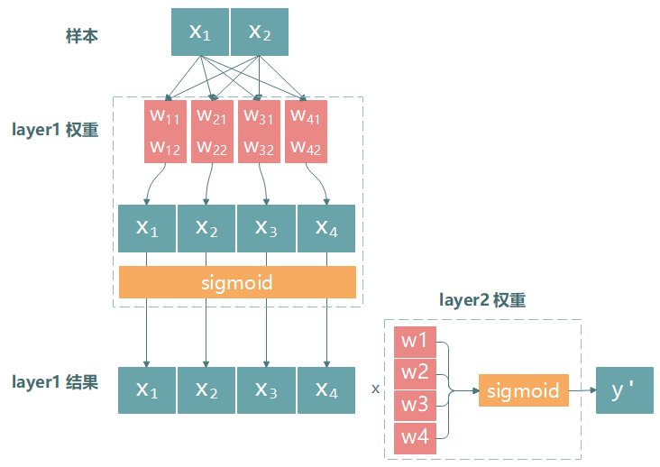

# 深度学习DAY01

## 深度学习概述

### 引言

早期的深度学习受到了神经科学的启发，它们之间有着非常密切的联系。深度学习方法能够具备提取抽象特征的能力，也可以看作是从生物神经网络中获得了灵感。

#### 机器学习与深度学习对比

**传统机器学习过程**

1. 特征提取与人工整理
2. 选择机器学习模型
3. 针对训练集进行模型训练，得到最优模型参数
4. 针对测试集进行测试，得到预测结果

**深度学习过程（以图像数据为例）**

1. 输入（原始图片数据）
2. 提取基础特征（灰度处理，整理基础图片特征数据，图像像素）
3. 提取复杂特征（可以有多个步骤，每次提取获取不同的图像信息：线条、简单形状、复杂形状）
4. 模型训练，得到最优模型参数      
5. 得到预测结果

传统机器学习算法需要在样本数据输入模型前经历一个人工特征提取的步骤，之后通过算法更新模型的权重参数。经过这样的步骤后，当在有一批符合样本特征的数据输入到模型中时，模型就能得到一个可以接受的预测结果。

而深度学习算法不需要在样本数据输入模型前经历一个人工特征提取的步骤，将样本数据输入到算法模型中后，模型会从样本中提取基本的特征（图像的像素）。之后，随着模型的逐步深入，从这些基本特征中组合出了更高层的特征，比如线条，简单形状（如汽车轮毂边缘）等。此时的特征还是抽象的，我们无法形象这些特征组合起来会得到什么，简单形状可以被进一步组合，在模型越深入的地方，这些简单的形状也逐步地转化成更加复杂的特征（特征开始具体化，比如看起来更像一个轮毂而不是车身），这就使得不同类别的图像更加可分。这时，将这些提取到的特征再经历类似的机器学习算法中的更新模型权重参数等步骤，也就可以得到一个令人满意的结果。

## 神经网络简介

### 神经元

生物学神经元简单介绍

1904年生物学家就已经知晓了神经元的组成结构。


1. 每个神经元都是一个信息处理单元，且具有多输入但输出特性。

2. 神经元的输入可分为兴奋性输入和抑制性输入两种类型。

3. 神经元阈值特性，当细胞体膜内外电位差（由突触输入信号总和）超过阈值时产生脉冲，神经细胞进入兴奋状态。

4. 信息在突触结构间的传递存在延迟，神经元的输入与输出之间也具有一定的延时。

### 突触


突触是由突触前膜，突触间隙和突触后膜三部分构成，一个神经元的轴突末梢经过多次分支，最后每一小支的末端膨大呈杯状或球状，叫做突触小体。这些突触小体可以与多个神经元的细胞体或树突相接触而形成突触（一个神经元可以与多个突触小体进行连接）。

化学突触指的是突触前膜借助化学信号（即递质）将信息转送到突触后细胞；而电突触则借助电信号。化学突触和电突触都又相应地被分为兴奋性突触和抑制性突触。使下一个神经元产生兴奋效应的为兴奋性突触，使下一个神经元禅师抑制效应的为抑制性突触。因此看来，突触的主要作用是在神经元细胞传递信息。

### 人工神经网络

接下来我们仿照神经元模型建立一个人工神经网络，简称神经网络或连接模型。这是一种模仿动物神经网络行为特征，进行分布式信息处理的数学算法模型，本质就是按照生物神经圆的结构和工作原理构造出来一个抽象和简化了的数学模型。

这个模型不必模拟生物神经元的所有属性和行为，但要足以模拟它执行计算的过程。处理简单易表达的目的，我们忽略了不太相关的复杂因素。我们的人工神经网络模型是一个包含输入，输出与计算功能的模型。输入可以类比为神经元的树突，而输出可以类比为神经元的轴突，计算则可以类比为细胞核。

 

下图是一个典型的神经元模型：包含有2个输入，1个阈值，1个输出，以及2个计算功能。这些线称为“连接”。每个上有一个“权值”。


 对于某一个神经元，它可能同时接收了多个输入信号（输入1，2），神经元之间考形成突触的方式构成神经网络，但各个突触的结构的性质与连接强度不尽相同，具体表示时相同的输入可能对不同的神经元有不同的影响。引入权重值的目的就是为了模拟突触的这种表现，其征途代表了生物神经元中突出的兴奋或抑制，其大小则表示突触间的不同连接强度。

b 表示一个阈值。

考虑到神经元的累加性，我们对全部的输入信号进行累加整合，相当于生物神经元中膜电位的变化总量，其值可以用下述公式表示：


生物神经元的激活与否取决于输入信号与某一阈值电平的比较。在神经元模型中也是类似的，只有当其输入总和超过阈值b是才会被激活，否则神经元不会被激活，当处于激活后，可以计算出y值。

之后会在进行一个非线性变换，也就是经过非线性激活函数，计算出该节点的输出（激活值）a = g(y)

其中g(y) 为非线性函数。在深度学习中，常用的激活函数主要有，sigmid, tanh, ReLu。

比如此时我们选用sigmoid函数，该函数是将取值为负无穷到正无穷的数映射到（0，1）之间。Sigmoid函数的公式及图形如下。


若神经元的激活a为正值，称改神经元处于激活状态或兴奋状态，若a为负值，则称神经元处于抑制状态。

### 神经网络基本结构

简单神经网络可分为三层，分别是输入层、输出层、以及中间的隐藏层


输入层有3个输入单元，隐藏层有4个单元，输出层有2个单元。

1. 设计一个神经网络时，输入层与输出层的节点数往往是固定的，中间层则可以自由指定；

2. 神经网络结构图中的拓扑与箭头代表着预测过程时数据的流向，跟训练时的数据流有一定的区别；

3. 结构图里的关键不是圆圈（代表“神经元”），而是连接线（代表“神经元”之间的连接）。每个连接线对应一个不同的权重（其值称为权值），这是需要训练得到的。

### 神经网络训练过程

1. 整理输入与输出

   我们有一组样本数据。每个样本有三个输入特征与一个输出结果。我们需要做的就是通过三个输入特征值预测输出。

2. 模型搭建与训练

   依据设计好的神经网络结构，为每一层的输入分配权重，完成神经网络正向结构搭建。基于正向传播计算样本预测输出。根据已知训练样本，设计损失函数，基于反向传播不断迭代更新每一层的权重参数使得损失函数值向最低点快速收敛。

3. 预测

   使用训练好的一组权重，对未知输出的输入进行结果预测。 


#### 正向传播（FP - Forward Propagation）



正向传播推导过程如下：
$$
layer_0 = X \\
$$
根据第一层权重计算第一层结果：
$$
layer_1 = sigmoid(layer_0 \times W_1)
$$
根据第二层权重计算当前样本的预测输出：
$$
layer_2(out) = sigmoid(layer_1 \times W_2)) = y'
$$


#### 反向传播（BP - Backward Propagation）

根据预测结果与实际结果的误差设计损失函数，对损失函数求偏导，随着迭代次数的不断增加。从而从后向前更新权重的过程称为反向传播。


### 代码实现

1. 设计神经网络结构，按照已定结构训练神经网络实现分类业务。

```python
import numpy as np
import matplotlib.pyplot as mp
# sigmiod 函数
def active(x):
    return 1 / (1 + np.exp(-x))

# sigmoid函数导函数
def backward(x):
    return x * (1 - x)

# 单层网路前向传播
def forward(x, w):
    return np.dot(x, w)

x = np.array([
    [3, 1],
    [2, 5],
    [1, 8],
    [6, 4],
    [5, 2],
    [3, 5],
    [4, 7],
    [4, -1]])
y = np.array([0, 1, 1, 0, 0, 1, 1, 0]).reshape(-1,1)

# 随机初始化权重[-1 1)
w0 = 2 * np.random.random((2, 4)) - 1
w1 = 2 * np.random.random((4, 1)) - 1
lrate = 0.01

for j in range(10000):
    l0 = x
    l1 = active(forward(l0, w0))
    l2 = active(forward(l1, w1))
    # 损失
    l2_error = y - l2
    if (j % 100) == 0:
        print ("Error:" + str(np.mean(np.abs(l2_error))))
    l2_delta = l2_error * backward(l2)
    w1 += l1.T.dot(l2_delta * lrate)
    l1_error = l2_delta.dot(w1.T)
    l1_delta = l1_error * backward(l1)
    w0 += l0.T.dot(l1_delta * lrate)

def predict(x):
    l0 = x
    l1 = active(forward(l0, w0))
    l2 = active(forward(l1, w1))
    result = np.zeros_like(l2)
    result[l2>0.5] = 1
    return result


n = 500
l, r = x[:, 0].min() - 1, x[:, 0].max() + 1
b, t = x[:, 1].min() - 1, x[:, 1].max() + 1
grid_x = np.meshgrid(np.linspace(l, r, n),
                     np.linspace(b, t, n))
flat_x = np.column_stack((grid_x[0].ravel(), grid_x[1].ravel()))   

flat_y = predict(flat_x)
grid_y = flat_y.reshape(grid_x[0].shape)
mp.figure('SVM Linear Classification', facecolor='lightgray')
mp.title('SVM Linear Classification', fontsize=20)
mp.xlabel('x', fontsize=14)
mp.ylabel('y', fontsize=14)
mp.tick_params(labelsize=10)
mp.pcolormesh(grid_x[0], grid_x[1], grid_y, cmap='gray')
mp.scatter(x[:, 0], x[:, 1], c=y.ravel(), cmap='brg', s=80)
mp.show()
```

2. 封装模型

```python
import numpy as np
import matplotlib.pyplot as mp

class ANNModel():
    def __init__(self):
        # 随机初始化权重[-1 1)
        self.w0 = 2 * np.random.random((2, 4)) - 1
        self.w1 = 2 * np.random.random((4, 1)) - 1
        self.lrate = 0.1

    # sigmiod 函数
    def active(self, x):
        return 1 / (1 + np.exp(-x))

    # sigmoid函数导函数
    def backward(self, x):
        return x * (1 - x)

    # 单层网路前向传播
    def forward(self, x, w):
        return np.dot(x, w)

    def fit(self, x):
        for j in range(10000):
            l0 = x
            l1 = self.active(self.forward(l0, self.w0))
            l2 = self.active(self.forward(l1, self.w1))
            # 损失
            l2_error = y - l2
            if (j % 100) == 0:
                print ("Error:" + str(np.mean(np.abs(l2_error))))
            l2_delta = l2_error * self.backward(l2)
            self.w1 += l1.T.dot(l2_delta * self.lrate)
            l1_error = l2_delta.dot(self.w1.T)
            l1_delta = l1_error * self.backward(l1)
            self.w0 += l0.T.dot(l1_delta * self.lrate)

    def predict(self, x):
        l0 = x
        l1 = self.active(self.forward(l0, self.w0))
        l2 = self.active(self.forward(l1, self.w1))
        result = np.zeros_like(l2)
        result[l2>0.5] = 1
        return result

x = np.array([
    [3, 1],
    [2, 5],
    [1, 8],
    [6, 4],
    [5, 2],
    [3, 5],
    [4, 7],
    [4, -1]])
y = np.array([0, 1, 1, 0, 0, 1, 1, 0]).reshape(-1,1)

n = 500
l, r = x[:, 0].min() - 1, x[:, 0].max() + 1
b, t = x[:, 1].min() - 1, x[:, 1].max() + 1
grid_x = np.meshgrid(np.linspace(l, r, n),
                     np.linspace(b, t, n))
flat_x = np.column_stack((grid_x[0].ravel(), grid_x[1].ravel()))   
model = ANNModel()
model.fit(x)
flat_y = model.predict(flat_x)
grid_y = flat_y.reshape(grid_x[0].shape)
mp.figure('SVM Linear Classification', facecolor='lightgray')
mp.title('SVM Linear Classification', fontsize=20)
mp.xlabel('x', fontsize=14)
mp.ylabel('y', fontsize=14)
mp.tick_params(labelsize=10)
mp.pcolormesh(grid_x[0], grid_x[1], grid_y, cmap='gray')
mp.scatter(x[:, 0], x[:, 1], c=y.ravel(), cmap='brg', s=80)
mp.show()
```

