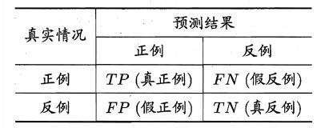
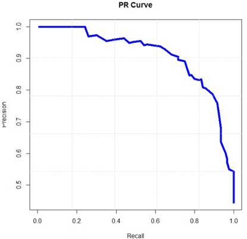
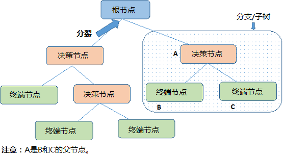
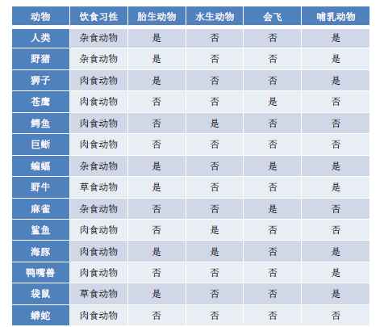
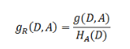
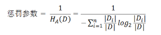
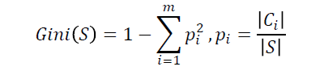

## 分类算法

​	分类算法和回归算法是对真实世界不同建模的方法。分类模型是认为模型的输出是离散的，例如大自然的生物被划分为不同的种类，是离散的。回归模型的输出是连续的，例如人的身高变化过程是一个连续过程，而不是离散的。

​	因此，在实际建模过程时，采用分类模型还是回归模型，取决于你对事物的分析和理解。

### 1 常用分类算法的优缺点

常用分类算法的优缺点

| 算法       | 优点                                                         | 缺点                                                         |
| :--------- | :----------------------------------------------------------- | ------------------------------------------------------------ |
| 线性回归   | 1）速度快。<br />2）简单易于理解，直接看到各个特征的权重。<br />3）能容易地更新模型吸收新的数据。<br /> | 特征处理复杂。需要归一化和较多的特征工程。                   |
| 决策树     | 1）不需要任何领域知识或参数假设。<br />2）适合高维数据。<br />3）简单易于理解。<br />4）在相对短的时间内能够对大型数据源做出可行且效果良好的结果。<br />5）能够同时处理数据型和常规性属性。 | 1. 对于那些各类别样本数目不一致的数据，信息增益的结果偏向于那些具有更多数值的属性；<br/>2. 对噪声数据较为敏感；<br/>3. 容易出现过拟合问题；<br/>4. 忽略了数据集中属性之间的相关性；<br/> |
| 朴素贝叶斯 | 1. 数学基础坚实，分类效率稳定，容易解释；<br/>2. 所需估计的参数很少，对缺失数据不太敏感；<br/>3. 无需复杂的迭代求解框架，适用于规模巨大的数据集。 | 1. 属性之间的独立性假设往往不成立（可考虑用聚类算法先将相关性较大的属性进行聚类）；<br/>2. 需要知道先验概率，分类决策存在错误率。 |

### 2 模型评估

#### **1 回归模型常用评估方法：**

|             指标              |     描述     |
| :---------------------------: | :----------: |
| Mean Square Error (MSE, RMSE) |   均方误差   |
|   Absolute Error (MAE, RAE)   | 平均绝对误差 |
|           R-Squared           |    R平方     |

#### 2 分类算法的评估方法

​	分类评估方法主要功能是用来评估分类算法的好坏，而评估一个分类器算法的好坏又包括许多项指标。了解各种评估方法，在实际应用中选择正确的评估方法是十分重要的。

​	一般情况来说，单一评分标准无法完全评估一个机器学习模型。只用good和bad偏离真实场景去评估某个模型，都是一种欠妥的评估方式。下面介绍常用的分类模型和回归模型评估方法。

**分类模型常用评估方法：**

|       指标       |               描述               |
| :--------------: | :------------------------------: |
|     Accuracy     |              准确率              |
|    Precision     |           精度/查准率            |
|      Recall      |          召回率/查全率           |
|      PR曲线      | 查准率为纵轴，查全率为横轴，作图 |
|        F1        |               F1值               |
| Confusion Matrix |             混淆矩阵             |
|       ROC        |             ROC曲线              |
|       AUC        |         ROC曲线下的面积          |

**回归模型常用评估方法：**

- **几个常用术语**
  ​	这里首先介绍几个常见的模型评价术语，现在假设我们的分类目标只有两类，计为正例（positive）和负例（negative）分别是：
   1) True positives(TP):  被正确地划分为正例的个数，即实际为正例且被分类器划分为正例的实例数；
   2) False positives(FP): 被错误地划分为正例的个数，即实际为负例但被分类器划分为正例的实例数；
   3) False negatives(FN):被错误地划分为负例的个数，即实际为正例但被分类器划分为负例的实例数；
   4) True negatives(TN): 被正确地划分为负例的个数，即实际为负例且被分类器划分为负例的实例数。　

  

  表2 四个术语的混淆矩阵


表2是这四个术语的混淆矩阵，做以下说明：
	1）P=TP+FN表示实际为正例的样本个数。
	2）True、False描述的是分类器是否判断正确。
	

3）Positive、Negative是分类器的分类结果，如果正例计为1、负例计为-1，即positive=1、negative=-1。

用1表示True，-1表示False，

那么实际的类标=TF\*PN，TF为true或false，PN为positive或negative。
	

4）例如True positives(TP)的实际类标=1\*1=1为正例，False positives(FP)的实际类标=(-1)\*1=-1为负例，False negatives(FN)的实际类标=(-1)\*(-1)=1为正例，True negatives(TN)的实际类标=1\*(-1)=-1为负例。


- **评价指标**
  1) **正确率（accuracy）**
  	正确率是我们最常见的评价指标，accuracy = (TP+TN)/(P+N)，正确率是被分对的样本数在所有样本数中的占比，通常来说，正确率越高，分类器越好。
  
- 2) **错误率（error rate)**
  	错误率则与正确率相反，描述被分类器错分的比例，error rate = (FP+FN)/(P+N)，对某一个实例来说，分对与分错是互斥事件，所以accuracy =1 -  error rate。
  
- 3) **灵敏度（sensitivity）**
  	sensitivity = TP/TP+FN，表示的是所有正例中被分对的比例，衡量了分类器对正例的识别能力。
  
- 4) **特异性（specificity)**
  	specificity = TN/FP+TN，表示的是所有负例中被分对的比例，衡量了分类器对负例的识别能力。
  
- 
  
- 5) **精度（precision）**（查准率）
  	precision=TP/(TP+FP)，精度是精确性的度量，表示被分为正例的示例中实际为正例的比例。
  
- 6) **召回率（recall）**（查全率）
  	召回率是覆盖面的度量，度量有多少个正例被分为正例，recall=TP/(TP+FN)=sensitivity，可以看到召回率与灵敏度是一样的。
  
- 7) 其他评价指标
  	
  
- 计算速度：分类器训练和预测需要的时间；
  	
  
- 鲁棒性：处理缺失值和异常值的能力；
  
- 可扩展性：处理大数据集的能力；
  	
  
- 可解释性：分类器的预测标准的可理解性，像决策树产生的规则就是很容易理解的，而神经网络的一堆参数就不好理解，我们只好把它看成一个黑盒子。
  
- **ROC曲线和PR曲线**

  如图2-3，ROC曲线是（Receiver Operating Characteristic Curve，受试者工作特征曲线）的简称，是**以灵敏度（真阳性率）为纵坐标**，**以1减去特异性（假阳性率）为横坐标**绘制的性能评价曲线。可以将不同模型对同一数据集的ROC曲线绘制在同一笛卡尔坐标系中，ROC曲线越靠近左上角，说明其对应模型越可靠。也可以通过ROC**曲线下面的面积（Area Under Curve, AUC）**来评价模型，AUC越大，模型越可靠。


​	                                                                         图2-3 ROC曲线

​	PR曲线是Precision Recall Curve的简称，描述的是precision和recall之间的关系，**以recall为横坐标，precision为纵坐标**绘制的曲线。该曲线的所对应的面积AUC实际上是目标检测中常用的评价指标**平均精度（Average Precision, AP）**。AP越高，说明模型性能越好。



## 决策树

### 1 决策树的基本原理

​	决策树（Decision Tree）是一种分而治之的决策过程。一个困难的预测问题，通过树的分支节点，被划分成两个或多个较为简单的子集，从结构上划分为不同的子问题。将依规则分割数据集的过程不断递归下去（Recursive Partitioning）。随着树的深度不断增加，分支节点的子集越来越小，所需要提的问题数也逐渐简化。

当分支节点的深度或者问题的简单程度满足一定的停止规则（Stopping Rule）时, 该分支节点会停止分裂，此为自上而下的停止阈值（Cutoff Threshold）法；有些决策树也使用自下而上的剪枝（Pruning）法。



### 2 决策树算法

决策树通过把数据样本分配到某个叶子结点来确定数据集中样本所属的分类

决策树由决策结点、分支和叶子结点组成
–决策结点表示在样本的一个属性上进行的划分
–分支表示对于决策结点进行划分的输出
–叶结点（终端节点）代表经过分支到达的类。

从决策树根结点出发，自顶向下移动，在每个决策结点都会进行次划分，通过划分的结果将样本进行分类，导致不同的分支，最后到达个叶子结点，这个过程就是利用决策树进行分类的过程

### 3 决策树的三要素

​	一棵决策树的生成过程主要分为下3个部分：  

​	1、特征选择：从训练数据中众多的特征中选择一个特征作为当前节点的分裂标准，如何选择特征有着很多**不同量化评估标准**，从而衍生出不同的决策树算法。 

​	2、决策树生成：根据选择的特征评估标准，从上至下**递归地**生成子节点，直到数据集不可分则决策树停止生长。树结构来说，递归结构是最容易理解的方式。 

​	3、剪枝：决策树容易过拟合，一般来需要剪枝，缩小树结构规模、缓解过拟合。剪枝技术有**预剪枝**和**后剪枝**两种。

### 问题：如何选取特征进行分裂




### 4 信息熵（Information Entropy）

在信息论中，**熵**（entropy）是接收的每条消息中包含的信息的平均量，又被称为**信息熵**。这里，“消息”代表来自分布或数据流中的事件、样本或特征。

信息熵（Information Entropy）：度量随机变量的不确定性，是衡量样本集合纯度的指标。  

定义：

假设随机变量X的可能取值有$x_{1},x_{2},...,x_{n}$，对于每一个可能的取值 $x_{i}$，其概率为$P(X=x_{i})=p_{i},i=1,2...,n$。随机变量的熵为：
$$
H(X)=-\sum_{i=1}^{n}p_{i}log_{2}p_{i} 
$$
​       对于样本集合，假设样本有k个类别，每个类别的概率为$\frac{|C_{k}|}{|D|}$，其中 ${|C_{k}|}$ 为类别为k的样本个数，$|D|$为样本总数。样本集合D的熵为：
$$
H(D)=-\sum_{k=1}^{k}\frac{|C_{k}|}{|D|}log_{2}\frac{|C_{k}|}{|D|}
$$
举例来说，如果有一个大小为10的布尔值样本集d ，其中有6个真值、4个假值，那么该布尔型样本分类的熵为
$$
H(d)=-(\frac{6}{10})log_{2}\frac{6}{10}-(\frac{4}{10})log_{2}\frac{4}{10}=0.9710
$$

```python
import numpy as np
H = -(6/10)*np.log2(6/10)-(4/10)*np.log2(4/10)
print(H)

H1 = -(10/10)*np.log2(10/10)
print(H1)
H2 = -(1/10)*np.log2(1/10)-(9/10)*np.log2(9/10)
print(H2)
H3 = -(3/10)*np.log2(3/10)-(4/10)*np.log2(4/10)-(3/10)*np.log2(3/10)
print(H3)
'''
0.9709505944546686
-0.0
0.4689955935892812
1.5709505944546684
'''
```

熵越小，说明样本中包含的信息量越少，样本信息越简单。

熵越大，说明样本中包含的信息量越多，样本信息越复杂。

### 5 特征评估标准

####  5.1 信息增益 (Information Gain) —— ID3算法

定义： 信息增益是以某特征划分数据集前后的熵的差值， 是计算分支属性对于样本集分类好坏程度的度量。

原理：由于分裂后样本集的纯度提高，则样本集的熵降低，熵降低的值即为该分裂方法的信息增益。

分裂前样本集合D的熵是一定的 ，entroy(前)，

使用某个特征A划分数据集D，计算划分后的数据子集的熵， entroy(后)

​                                   **信息增益 =**  **entroy(前) -**  **entroy(后)**	

假设划分前样本集合D的熵为H(D)。使用某个特征A划分数据集D，计算划分后的数据子集的熵为H(D|A)。  

则信息增益为：
$$
g(D,A)=H(D)-H(D|A)
$$
​	

4 8 2 

```python
#entroy(前)
E = -(8/14)*np.log2(8/14)-(6/14)*np.log2(6/14)
#entroy(后)
e1 = -(7/7)*np.log2(7/7)
e2 = -(1/7)*np.log2(1/7)-(6/7)*np.log2(6/7)
#信息增益
G=E-(7/14)*(e1)-(7/14)*(e2)
print(G)

0.6893917467430878
```

在构建决策树的过程中我们总是希望数据集以最快的方式进行分裂，达到最优的分类结果，因此我们总是选择信息增益最大的特征来划分当前数据集。

计算数据集D所有特征的信息增益，从这些信息增益中选择最大的，设为根节点进行分裂，由根结点处再计算其余特征的信息增益，选取合适的属性进行分裂，若新生成的结点的分类属性不唯一，则对新生成的结点继续进行分裂，不断重复此步骤，直至所有样本属于同一类，或者达到要求的分类条件为止。

**缺点**：信息增益偏向取值较多的特征

#### 5.2 信息增益比 —— C4.5算法

​	**信息增益比 = 惩罚参数 X 信息增益​**

​	信息增益比本质：在信息增益的基础之上乘上一个惩罚参数。特征个数较多时，惩罚参数较小；特征个数较少时，惩罚参数较大。 



​	惩罚参数：数据集D以特征A作为随机变量的熵的倒数。



```python
#惩罚参数
H6 = 1/(-(7/14)*np.log2(7/14)-(7/14)*np.log2(7/14))
Gr=G*H6
print(Gr)

0.6893917467430878
```

```python
#饮食习性
#信息增益
E = -(8/14)*np.log2(8/14)-(6/14)*np.log2(6/14)

e1 = -(3/8)*np.log2(3/8)-(5/8)*np.log2(5/8)
e2 = -(3/4)*np.log2(3/4)-(1/4)*np.log2(1/4)
e3 = -(2/2)*np.log2(2/2)

G=E - (8/14)*(e1)-(4/14)*(e2)-(2/14)*(e3)
print(G)
#信息增益比
H7 = (-(8/14)*np.log2(8/14)-(2/14)*np.log2(2/14)-(4/14)*np.log2(4/14))
Gr=G/H7
print(Gr)

0.20804352737451925
0.15088919207213097

```

**缺点**：信息增益比偏向取值较少的特征

#### 5.3 Gini指标——CART算法

CART 算法使用Gini系数作为区间纯度的度量标准




### 6 过拟合问题

​	在决策树算法中，为了尽可能正确分类训练样本， 节点划分过程不断重复， 有时候会造成决策树分支过多，以至于将训练样本集自身特点当作泛化特点， 而导致过拟合。 

​	解决过拟合问题，一方面要注意数据训练集的质量，选取具有代表性样本的训练样本集。另一方面要避免决策树过度增长，通过限制树的深度来减少数据中的噪声对于决策树构建的影响，一般可以采取剪枝的方法。

剪枝是用来缩小决策树的规模，从而降低最终算法的复杂度并提高预测准确度，包括预剪枝和后剪枝两类。

预剪枝（pre-pruning）的思路是提前终止决策树的增长，在形成完全拟合训练样本集的决策树之前就停止树的增长，避免决策树规模过大而产生过拟合

后剪枝（post-pruning）策略先让决策树完全生长，之后针对子树进行判断，用叶子结点或者子树中最常用的分支替换子树，以此方式不断改进决策树，直至无法改进为止