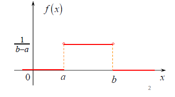

## 概率论

### 1 古典概型

若试验满足：

•样本空间S中样本点有限(**有限性**)

•出现每一个样本点的概率相等(**等可能性**)

称这种试验为等可能概型(或古典概型)
$$
P(A)=\frac{A所包含的样本点数}{S中的样本点数}
$$

### 2 条件概率

事件*B*在事件*A*发生的条件下发生的概率：
$$
P(B|A)=\frac{P(AB)}{P(A)}, \quad P(A)\not= 0
$$

$$
P(AB) = P(A) \cdot P(B | A) = P(B) \cdot P(A| B)
$$

### 3 全概率公式

设 $B_1,B_2,...,B_n$ 为 样本空间S 的一个划分且 $P(B_i )> 0$ . 则有全概率公式：
$$
P(A)=\sum^n_{j=1}P(B_j) \cdot P(A|B_j)
$$

$$
P(A)=\sum^n_{j=1}p_jq_j
$$

### 4 贝叶斯公式

设 $B_1,B_2,...,B_n$ 为 S 的一个划分且 $P(B_i)> 0$ . 对 $P(A)>0$ 则有贝叶斯公式:

## 随机变量

### 随机变量（Random Variable）

设随机试验的样本空间为S，若 $X=X(e)$ 为定义在S 上的实值单值函数，则称 X(e) 为随机变量， 简写为X。

随机变量X 表示随机试验各种结果的实值单值函数。

随机变量可以是离散型的，也可以是连续型的。

如果随机变量 ${\displaystyle X}$ 的取值是有限的或者是可数无穷尽的值

则称X 为离散型随机变量。

如果 ${\displaystyle X}$ 由全部实数或者由一部分区间组成，

, 

则称 ${\displaystyle X}$ 为连续随机变量，连续随机变量的取值是不可数及无穷尽的。

### 离散型随机变量及其概率分布

##### 0-1分布（伯努利分布）

若X的概率分布为

其中 $0<p<1$ , 就称X服从参数为 p 的 0-1 分布（或两点分布），记为 $X \sim B(1，p)$ . 1表示1次伯努利实验，p表示X取1的概率。

对于只有两个可能结果的试验, 称为伯努利(Bernoulli) 实验，故两点分布有时也称为伯努利分布.

应用：

检查产品的质量是否合格
对新生婴儿的性别进行登记
检验种子是否发芽
考试是否通过
求婚是否成功
马路乱停车是否会受罚

##### 二项分布 (Binomial)

若X的概率分布为
$$
P(X=k)=C_n^kP^k(1-p)^{n-k}, k=0,1,2,...n
$$
则称X 服从参数为n, p的二项分布, 记为 X~B（n，p），其中 $0<p<1$ .

当n=1时，为伯努利分布。

二项分布描述的是n重伯努利试验中“成功”出现次数 X 的概率分布.

##### 泊松分布（Poisson）

若X的概率分布为
$$
P(X=k)=\frac{\lambda^k}{k!}e^{-\lambda},\quad  k=0,1,2,...n, \quad \lambda>0
$$
则称X服从参数为 $\lambda$ 的泊松分布, 记作 $X \sim P(\lambda)$ .

泊松分布适合于描述单位时间内随机事件发生的次数的概率分布。

如果某事件以固定强度 λ, 随机且独立地出现，该事件在单位时间内出现的次数（个数）可以看成是服从泊松分布.

应用：

某人一天内收到的微信的数量
来到某公共汽车站的乘客
某放射性物质发射出的粒子
显微镜下某区域中的白血球

### 连续型随机变量及其概率密度

设随机变量X的分布函数为F(x),  若存在一个非负的函数 f(x), 对任何实数 x , 有
$$
F(x)=\int^x_{-\infty}f(t)dt
$$
则称X为连续型随机变量, 称f(x)为X的概率密度函数, 简称概率密度.也可记为 $f_x(x )$ .

#### 均匀分布（uniform distribution）

若随机变量X的概率密度为
$$
f(x)=\left\{{\begin{matrix}{\frac  {1}{b-a}}&\ \ \ {\mbox{ }}a\leq x\leq b\\0&{\mbox{其他}}\end{matrix}}\right.
$$
其中 $a<b$ ，就称 X服从（a，b）上的均匀分布，记为  ${\displaystyle X\sim U(a,b)}$ . 

性质：均匀分布具有等可能性,  X落入(a,b)中的等长度的任意子区间上是等可能的.

#### 指数分布 （Exponential distribution）

若X 的概率密度函数为

其中 $\lambda>0$ , 就称X 服从参数为 $\lambda$ 的指数分布，记为  $X \sim E(\lambda)$ .

指数分布可以用来表示独立随机事件发生的时间间隔，比如旅客进入机场的时间间隔、打进客服中心电话的时间间隔。

#### 正态分布（normal distribution）

**正态分布**又名**高斯分布**（**Gaussian distribution**）

若X的概率密度函数为
$$
f(x)={1 \over \sigma\sqrt{2\pi} }\,e^{- {{(x-\mu )^2 \over 2\sigma^2}}}, \quad -\infty<x<+\infty
$$
其中 $-\infty <\mu<+\infty, \sigma>0$ , 就称X 服从参数为  $\mu, \sigma$ 的正态分布（高斯分布），记为

  ${\displaystyle X\sim N[\mu,\sigma^2]}$ .

其中 $\mu$ 称为位置参数，决定对称轴的位置； $\sigma$ 称为尺度参数，决定曲线分散程度。

应用：

测量误差

人的身高、体重

医学检验指标(红细胞数、血小板)

## 支持向量机（SVM）

支持向量机（Support Vector Machine，SVM）属于**有监督学习模型**，主要用于**解决数据分类问题**。通常SVM用于二元分类问题，对于多元分类可将其分解为多个二元分类问题，再进行分类，主要应用场景有图像分类、文本分类、面部识别和垃圾邮件检测等领域。

以一个二元分类问题为例讲解模型原理。首先假设有两类数据，如图需要找出一条边界来将两类数据分隔开来。

下图中列出一些可行的分隔方式。在当前的数据集的条件下，三种分隔方式都是可行的，我们该如何做选择？

一般说来，需要选择的是具有**较强分类能力的直线**，**有较稳定的分类结果**和**较强的抗噪能力**，比如在数据集扩展之后如下图所示。在这三种分隔方式中，b的分隔效果更好。

找到最优分类数据的分界线，使得对样本数据的分类效果更好的方法就是要**尽可能地远离两类数据点**，即数据集的边缘点到分界线的距离d最大，这里虚线穿过的边缘点称作支持向量，分类间隔为2d。如下图所示。

在二维平面上，最优分界线：b

如何将二维分类问题拓展到三维，甚至更高维的空间中呢？

为了不失一般性，我们把最优分界线称分离超平面，用 分离超平面来划分高维空间中的数据集。

SVM是从线性可分情况下的最优分类面发展而来的。

• 分类超平面：$(w \cdot x)+b = 0$，即 H, 其中w是法向量
• 判决函数：$y_i=sgn({w} \cdot x+{b}) \quad  y_i \in \{-1,1\}$ 
• 最大间隔问题：在间隔固定为1时，寻求最小的 ‖w‖支持向量：

支持向量：

在线性可分情况下，训练数据集的样本点中与分离超平面距离最近的样本点的实例称为支持向量。支持向量是使约束条件成立的点。即在$H_1$和$H_2$上的点就是支持向量。

间隔和间隔边界：

$H_1$和$H_2$之间的距离就是间隔，间隔等于$\frac{2}{||w||}$，$H_1$和$H_2$称为间隔边界。

### 1.线性可分支持向量机（硬间隔支持向量机）

#### 分类超平面

$$
(w \cdot x)+b = 0
$$

#### 函数间隔和几何间隔

##### 函数间隔：

对于给定的训练数据集T和超平面（w,  b），定义超平面（w，b）关于样本点（$x_i, y_i$) 的函数间隔为
$$
\hat{\gamma_i}=y_i(w\cdot x_i+b)
$$
函数间隔最小值：$\hat{\gamma}=\min_{i=1,...,N}{\hat{\gamma_i}}$

函数间隔可以表示分类预测的正确性和确信度，但是成比例改变w和b时，如2w和2b，超平面没有改变，函数间隔却扩大了2倍，这时可以对分离超平面的法向量w加入某些约束，如规范化，$\begin{Vmatrix}w\end{Vmatrix}=1$, 使得间隔是确定的，这时函数间隔就成为几何间隔。

##### 几何间隔：

对于给定的训练数据集T和超平面（w,  b），定义超平面（w，b）关于样本点（$x_i, y_i$) 的几何间隔为
$$
\gamma_{i}=y_i(\frac{w}{||w||}x_i+\frac{b}{||w||})
$$
几何间隔最小值：$\gamma=\min_{i=1,...,N}{\gamma_i}$

函数间隔和几何间隔的关系：
$$
\gamma_{i}=\frac{\hat{\gamma_i}}{||w||}
\\
\gamma=\frac{\hat{\gamma}}{||w||}
$$
如果$||w||=1$， 那么函数间隔和几何间隔相等。如果超平面参数w和b成比例的改变（超平面没有改变），函数间隔也因此比例改变，而几何间隔不变。

